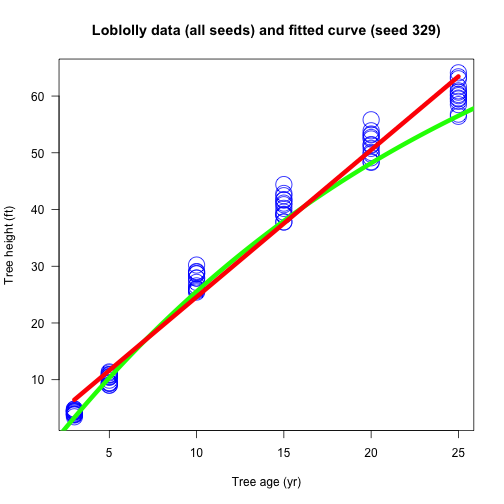

What do we know about the loblolly pine?
========================================================

Pinus taeda, commonly known as loblolly pine, is one of several pines native to the Southeastern United States, from central Texas east to Florida, and north to Delaware and southern New Jersey.
- For its timber, the pine species is regarded as the most commercially important tree in Southeastern US
- Loblolly pine can reach a height of 30–35 m (98–115 ft) with a diameter of 0.4–1.5 m (1.3–4.9 ft)
- The seed cones are green, ripening pale buff-brown, 7–13 cm (2.8–5.1 in) in length, 2–3 cm (0.79–1.18 in) broad when closed, opening to 4–6 cm (1.6–2.4 in) wide, each scale bearing a sharp 3–6 mm spine

--- 

Growth of Loblolly pine trees
========================================================
first some numbers...

```r
summary(Loblolly)
```

```
##      height           age            Seed   
##  Min.   : 3.46   Min.   : 3.0   329    : 6  
##  1st Qu.:10.47   1st Qu.: 5.0   327    : 6  
##  Median :34.00   Median :12.5   325    : 6  
##  Mean   :32.36   Mean   :13.0   307    : 6  
##  3rd Qu.:51.36   3rd Qu.:20.0   331    : 6  
##  Max.   :64.10   Max.   :25.0   311    : 6  
##                                 (Other):48
```


--- 

What is the height of each individual tree related to age?
========================================================
- Which line is the better fit?
The linear line or the fitted one?

 


--- 

What is the relation between age and height?
========================================================
- There is a strong correlation:


```
## [1] 0.9899132
```


